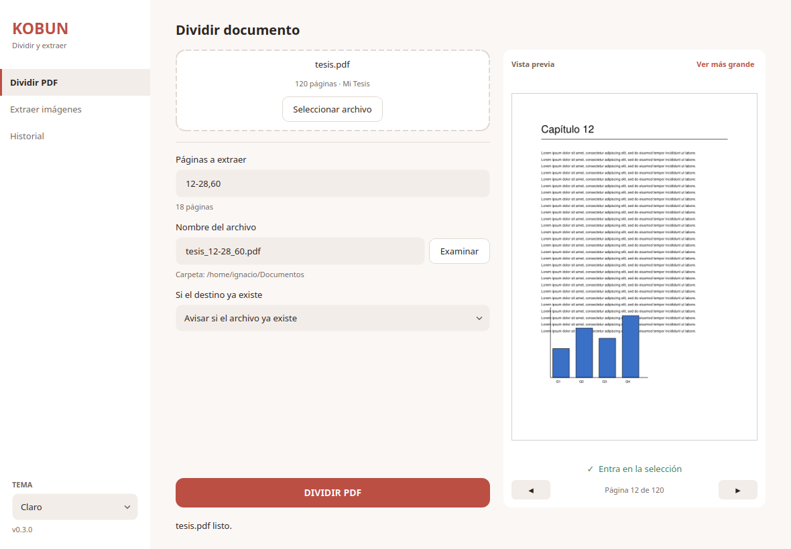
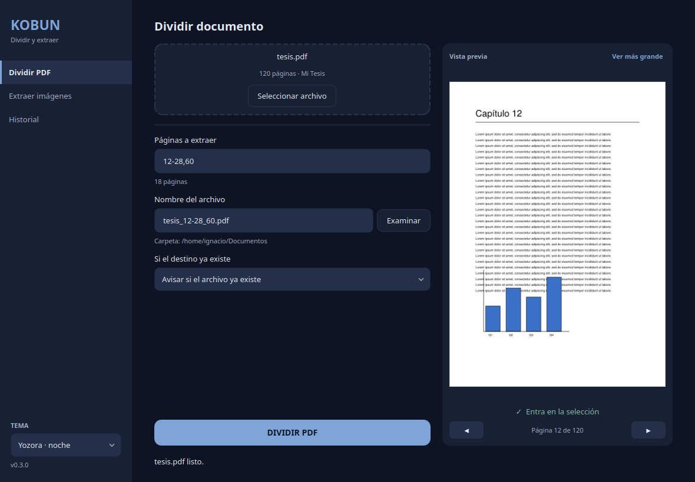
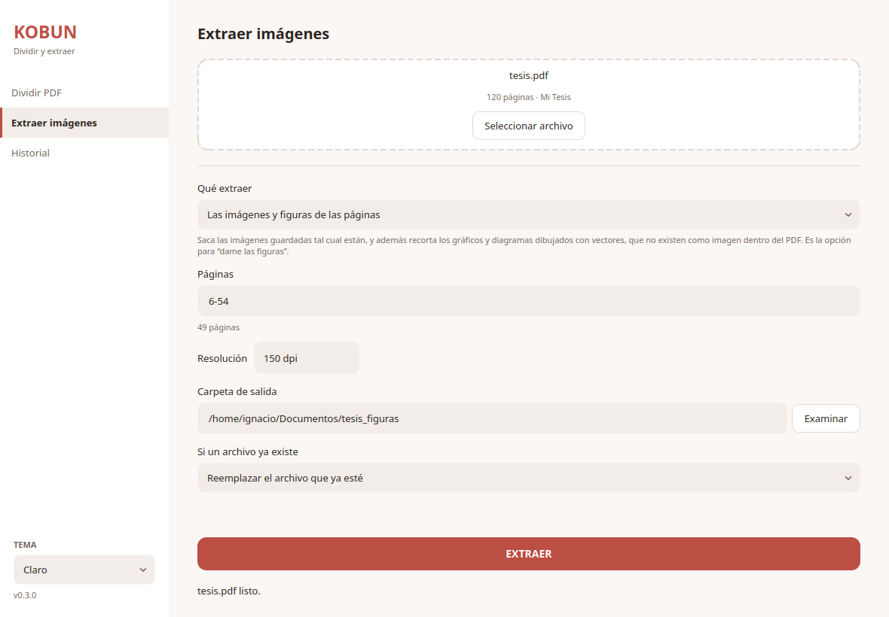
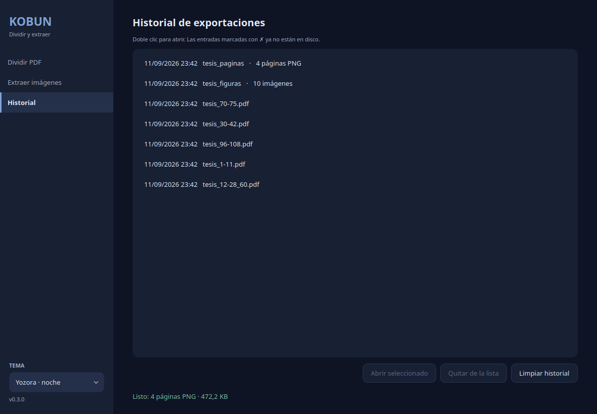

# Kobun — PDF Desktop Utility

[](https://github.com/IgnacioBarraza/kobun/actions/workflows/ci.yml)
[](https://github.com/IgnacioBarraza/kobun/releases/latest)

[](LICENSE)

Desktop utility that pulls what you need out of a PDF without touching the
original: **page ranges — including discontinuous ones, like `1-5,10-15,20` —**
into a new file, or **the images of those pages** into a folder. Built for the
cases PDF viewers handle badly: three chapters out of a 600 page book in one
pass, or every figure in a chapter without screenshotting them one by one.

Written in Python with **PySide6 (Qt)** and **PyMuPDF**, on a layered
architecture where the domain knows neither of them: **8,700 lines of code held
up by 9,400 of tests, 609 of which run with no dependencies installed at all.**

| Splitting, with the page in view | The same screen, dark |
| -------------------------------- | --------------------- |
|  |  |

| Extracting images and figures | Export history |
| ----------------------------- | -------------- |
|  |  |

---

## ⬇️ Download

Grab the latest build from the [releases page](https://github.com/IgnacioBarraza/kobun/releases/latest).
Versions tagged as pre-release come from `develop` and are meant for trying
changes early; the definitive ones come from `main`.

### Windows

`kobun.exe` is **portable**: download it and open it, there is nothing to
install. Windows will warn about an unsigned executable the first time.

### Linux

The `.deb` is the recommended route — it installs Kobun into the application
menu with its icon:

```bash
sudo apt install ./kobun_*_amd64.deb
```

The standalone `kobun` binary works on other distributions, with two caveats:
you have to make it executable with `chmod +x` (the download loses that bit),
and **modern file managers will not launch a binary on double click**, so run it
from a terminal.

### From source

```bash
python -m venv .venv && source .venv/bin/activate
pip install -r requirements.txt
kobun
```

---

## ✨ Features

### Splitting

- Extract page ranges, including discontinuous selections: `1-5,10-15,20`
- Overlapping or adjacent ranges are merged automatically — no duplicate pages
- Page indices are 1-based and inclusive, as printed in the document
- Output metadata derived from the source document, traceable back to it
- **A live count while you type**: "6 páginas" as you write `1-5,10`, and
  "8 páginas: 1-8" when overlapping ranges get merged, so a selection that covers
  fewer pages than it looks like does not read as a bug
- A range still being typed is not shouted at: `1-` says which number is missing
  in the ordinary text colour, because "1-5" is reached by way of "1-" and every
  range would otherwise flash an error at the person writing it
- **A page preview filling its own column** beside the options, which follows the
  first page of the selection and says whether the page on screen is one of the
  pages that will be exported. Arrows step through the whole document; a page
  already rendered comes back from a cache instead of being painted again
- **"Ver más grande"** ([shown here](assets/screenshots/preview-light.png)) opens
  the page at reading size in a window shaped to the page —tall for a portrait
  page, wide for a landscape one— and sized to the screen. It is modeless and points at the same state as the thumbnail, so both
  always show the same page and stepping in one moves the other. The render
  resolution follows what the window can actually display, so it is neither
  wasted on a laptop nor soft on a 4K panel
- A range the document cannot satisfy is explained where it is typed —"La página
  20 no existe: este PDF llega hasta la 12"— and keeps the button disabled,
  instead of failing with a dialog after the click

### Extracting images

- **Figures, whatever they are made of.** The default mode returns the stored
  images *and* the vector artwork — a chart drawn with lines and fills is not an
  image inside the PDF, so it is rendered from the region of the page it
  occupies. Cropping the figure, not screenshotting the page
- The region is worked out from the drawings on the page, with the page border,
  the rules and the body text kept out, and the axis labels brought in: a chart
  whose labels are cut off is a chart nobody can read
- A stricter mode returns **only** what the PDF stores, so nothing on disk was
  painted by Kobun; a third renders whole pages, for when even that is what you
  want
- Never a lossy re-encode: a stored JPEG comes out as the identical JPEG, and an
  image the PDF keeps as raw samples is wrapped losslessly into PNG
- An image reused across pages —a header logo— comes out **once**, not once per
  page, and a border drawn around a photo does not yield a second, rendered copy
  of it
- Invisible 1x1 spacers and hairline rules are filtered out, so the folder holds
  figures and not slivers
- **One folder you choose, everything in it.** The destination is a full path you
  can point anywhere, and it stays put: it does not depend on the page selection,
  it survives changing mode, extracting, and opening another PDF. Extracting 1-5
  and then 6-10 collects both in the same place instead of making a folder per
  run. Files already in that folder are left alone, and re-extracting the same
  pages replaces its own output rather than piling up copies
- Files are named `book_p007_img02.png` for a stored image and
  `book_p007_fig01.png` for a rendered figure, zero-padded so the folder's
  alphabetical order matches the document's, and telling the originals apart from
  the renders at a glance
- **Finding nothing is a result, not an error**: the screen says the pages hold
  no images or figures and points at the mode that would work, instead of leaving
  an empty folder behind

### Choosing where it lands

- Suggested output filename: `book.pdf` + `1-5,10-15` → `book_1-5_10-15.pdf`,
  sanitized for Windows/Linux
- The destination field asks for a filename; the folder is shown separately
- Output never overwrites silently — `OverwritePolicy` (`FAIL` / `OVERWRITE` /
  `RENAME`) — and never writes over the source file
- A destination picked through the dialog is remembered: opening another PDF
  offers a new default name inside it, rather than moving the output back next to
  the source

### Reading the input safely

- Rejects unreadable input before processing: missing files, directories,
  empty files, non-PDFs, and password-protected PDFs
- Strict domain validation for invalid page ranges
- Explicit domain-level exceptions — PyMuPDF errors never reach the caller

### Interface

- Drag & drop, or pick a file from the system dialog. It also opens a PDF passed
  on the command line or chosen through the desktop's "Open with"
- The window opens at as much of the screen as it needs and no more, so the
  preview is not width-limited on a laptop nor a small square on a large monitor
- Long operations run on a worker thread, so the window never freezes
- **When an export finishes** a result card names what was produced and offers
  to open it or show it in its folder, and the taskbar entry asks for attention
  if the window is not the focused one. Deliberately not a modal: an export is
  repetitive, and a dialog per export is a dialog people learn to dismiss
  without reading
- Expected errors are reported as warnings; unexpected ones show a generic
  message and keep the technical detail for reporting
- **10 themes**, 5 light and 5 dark, most of them built around a Japanese
  palette (washi, indigo, matcha, ink, bamboo, violet…). The choice persists
  between sessions

### Export history

- Persistent history of the last 50 exports, stored per-OS in the user's data
  directory
- Entries whose file was moved or deleted are flagged, not dropped
- Open an exported PDF with the system viewer —or show an extraction's folder
  in the file manager, which is not the same gesture— or drop a single entry,
  straight from the list

---

## 🧱 Architecture

Kobun follows a layered structure inspired by Domain-Driven Design:

```
kobun/
│
├── domain/         # Core business rules and value objects
├── application/    # Use cases, DTOs and port interfaces
├── infrastructure/ # PDF engine, filesystem and persistence (PyMuPDF, JSON)
├── presentation/   # Qt UI (PySide6) and viewmodels
├── shared/         # Cross-cutting concerns (themes, settings, icons)
└── tests/          # unit/ (no dependencies) and integration/ (real PDFs, real window)

assets/             # Source artwork and screenshots, not shipped with the package
docs/               # Development and release documentation, plus the changelog
scripts/            # Build, packaging, release and desktop integration helpers
packaging/          # PyInstaller recipe and Inno Setup script
```

**Principles that are actually enforced, not just stated:**

- Immutable Value Objects, validated on construction and kept in canonical
  form — two selections covering the same pages are equal
- Explicit domain exceptions; the repository guarantees no PyMuPDF error escapes
- **Page indices are 1-based everywhere** — from `PageRange` up to the UI. The
  translation to PyMuPDF's 0-based API happens only inside `PdfEngineAdapter`
- The UI knows no use cases: the window talks to a viewmodel, and the viewmodel
  is the only thing that touches the application layer
- The `unit/` suite runs without PySide6 or PyMuPDF installed, and CI fails if
  that stops being true — which is what keeps the domain framework-free

---

## 🧪 Tests

```bash
pytest                    # everything
pytest kobun/tests/unit   # pure domain, no dependencies
```

Details, and everything about building and releasing, live in
[`docs/development.md`](docs/development.md).

---

## 📂 Example

1. Drop `book.pdf` on the window
2. Enter a page selection: `25-40`, or `1-5,10-15,20` for several sections at once
3. Click **DIVIDIR PDF**
4. Receive a PDF with exactly those pages, in that order

Or, on the **Extraer imágenes** screen, the same selection gives you a folder
with the figures of those pages — or with each page rendered as a PNG.

From code:

```python
document = load_use_case.execute(Path("book.pdf"))       # validates the source
selection = PageSelection.parse("1-5,10-15")

response = split_use_case.execute(SplitPdfRequest(
    input_path=document.storage_path,
    selection=selection,
    output_path=None,                                    # suggested name
    policy=OverwritePolicy.RENAME,                       # do not fail if taken
))

record_use_case.execute(response)                        # add it to the history
```

---

## 🛣 Roadmap

Done:

- [x] Multiple range support (`1-5,10-15`), merged and canonicalised
- [x] Output path selection with an overwrite policy
- [x] Export history
- [x] Qt UI wired to the use cases through a viewmodel
- [x] Light / dark theme system — 10 palettes, contrast verified by tests
- [x] Installable package with a `kobun` entry point
- [x] Windows and Linux packaging: portable `.exe`, `.deb`, Inno Setup installer
- [x] Automated versioning, changelog and releases derived from the commits
- [x] Image extraction: stored images, vector figures cropped from the page, or
      whole pages rendered to PNG
- [x] Result card with "open" and "show in folder", plus a taskbar notice when
      an export finishes out of focus
- [x] Page preview before splitting, following the selection and flagging whether
      the page on screen is included, with an enlarged view for reading it
- [x] Live page count and range explanation while typing a selection

Next:

- [ ] Repeat an export from the history (the selection is already stored as a
      Value Object precisely for this)
- [ ] Table extraction to CSV — `find_tables()` exists in PyMuPDF, but detection
      is approximate and needs a UI honest about that before it ships
- [ ] Merge PDFs and extract text — implemented in the repository layer, not yet
      exposed in the interface
- [ ] Batch splitting
- [ ] A CLI alongside the window
- [ ] Code signing for Windows, to drop the SmartScreen warning
- [ ] macOS build, once there is a machine to verify it on

---

## 🤝 Contributing

Contributions are welcome. Fork, branch, and open a pull request with a clear
technical description.

Two conventions worth knowing before the first commit:

- **Commits follow [Conventional Commits](https://www.conventionalcommits.org/)**,
  and they decide the version. `feat:` publishes a minor, `fix:` a patch, and a
  commit with no `type:` prefix publishes nothing at all — see
  [`docs/releasing.md`](docs/releasing.md)
- **Code and comments are in English; the interface is in Spanish.** That
  includes the messages of domain exceptions, which the UI shows to the user
  verbatim

And please keep the boundaries the project is built on: domain logic stays
UI-agnostic, new features come with validation and explicit error handling, and
the `unit/` suite must still run without PyMuPDF or PySide6 installed.

---

## 📄 License

Released under the MIT License. See [`LICENSE`](LICENSE) for details.
